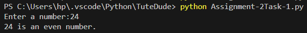
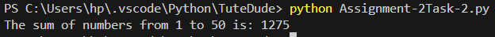

# Assignment 2  
## Module 3: Control Structures in Python

## Task 1: Check if a Number is Even or Odd
### Functionality
In this program, the user is asked to enter an integer number.
The program checks whether the entered number is even or odd using an if-else statement
and displays the result.

### Output

---

## Task 2: Sum of Integers from 1 to 50 Using a Loop
### Functionality
In this program, a for loop is used to add all integers from 1 to 50.
After the loop ends, the final sum is displayed on the screen.

### Output

