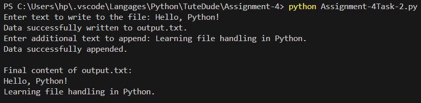

#Task 1: Read a File and Handle Errors
##Functionality
In this program, a text file named sample.txt is opened and read.
The content of the file is printed line by line.
If the file exists, the program displays all the lines from the file.
If the file does not exist, the program handles the error using try-except and displays a proper error message instead of crashing.
### Output (File Exists)
.PNG)

### Output (File Does Not Exist)
.PNG)

#Task 2: Write and Append Data to a File
##Functionality
In this program, the user enters some input, which is written to a file named output.txt.
After that, additional data is appended to the same file.
Finally, the program reads the file and displays the complete content on the screen.
This program helps in understanding file writing, appending, and reading operations in Python.
### Output

